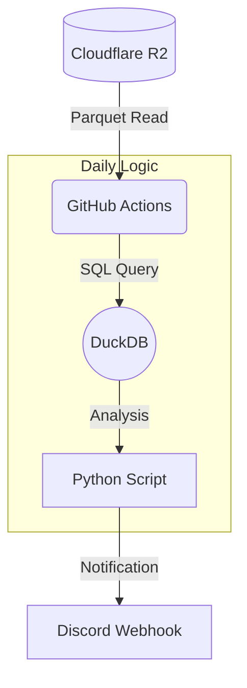

プロフェッショナルな仕上がりの `README.md` を作成しました。
これをリポジトリのトップに配置すると、システムの内容が一目でわかり、将来のメンテナンスも楽になります。

---

```markdown
# 📈 J-Quants Daily Screener

Cloudflare R2に蓄積された日本株データ（J-Quants API）を分析し、有望な銘柄を毎日自動でスクリーニングしてDiscordに通知するサーバーレス・ボットです。


## 🏗 システム構成

このシステムは「データ取得」とは切り離された**「分析専用」**のマイクロサービスです。



### 特徴
*   **完全サーバーレス**: GitHub Actions上で動作するため、常時稼働サーバーは不要です。
*   **高速処理**: DuckDB + Parquet形式により、大量の株価データをメモリ上で高速に集計します。
*   **責務の分離**: データ収集システム（Get-System）と分離することで、分析ロジックを安全かつ自由に書き換え可能です。
*   **Discord通知**: 分析結果（RSIシグナルなど）をスマホやPCに即座に通知します。

## 🚀 動作フロー

1.  **Trigger**: 毎日 **18:30 (JST)** にGitHub Actionsが起動。
2.  **Fetch**: Cloudflare R2から最新の株価データ（Parquet）を読み込み。
3.  **Analyze**: DuckDBを用いてテクニカル指標（現在はサンプルロジック）を計算。
4.  **Notify**: 条件に合致した銘柄をDiscordへ通知。

## 🛠 セットアップ

### 1. 前提条件
*   J-Quants APIのデータがCloudflare R2に保存されていること。
*   DiscordのサーバーおよびWebhook URLが発行されていること。

### 2. 環境変数の設定 (GitHub Secrets)
リポジトリの `Settings` > `Secrets and variables` > `Actions` に以下を設定してください。

| Secret名 | 説明 |
| :--- | :--- |
| `R2_ACCOUNT_ID` | CloudflareのアカウントID |
| `R2_ACCESS_KEY_ID` | R2のアクセスキー |
| `R2_SECRET_ACCESS_KEY` | R2のシークレットキー |
| `R2_BUCKET_NAME` | データが格納されているバケット名（例: `jquants-data`） |
| `DISCORD_WEBHOOK_URL` | 通知先のDiscord Webhook URL |

### 3. ローカルでの実行方法（開発用）

```bash
# ライブラリのインストール
pip install -r requirements.txt

# 環境変数をセットして実行 (Windows PowerShell例)
$env:R2_ACCOUNT_ID="your_id"; python src/daily_scan.py
```

## 📂 ディレクトリ構成

```
.
├── .github/
│   └── workflows/
│       └── daily_process.yml  # 自動実行のスケジュール設定 (Cron)
├── src/
│   └── daily_scan.py          # 分析・通知ロジックの本体
├── requirements.txt           # 依存ライブラリ (duckdb, pandas etc.)
└── README.md                  # 本ドキュメント
```

## 📅 ロードマップ

- [x] R2接続とDuckDBによる高速読み込み
- [x] Discord通知の実装
- [x] GitHub Actionsによる定期実行化 (18:30 JST)
- [ ] RSI（相対力指数）による逆張りシグナルの実装
- [ ] MACD、移動平均線乖離率などの指標追加
- [ ] 出来高急増銘柄の検知ロジック

## ⚠️ 免責事項

本ソフトウェアは教育および研究目的で開発されています。本システムによる分析結果に基づくいかなる投資判断についても、開発者は責任を負いません。投資は自己責任で行ってください。
```
